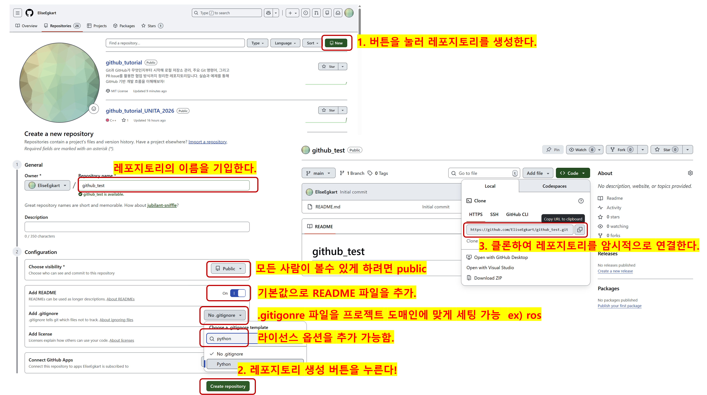
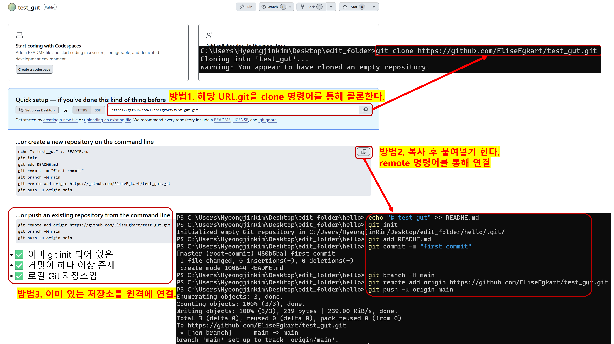
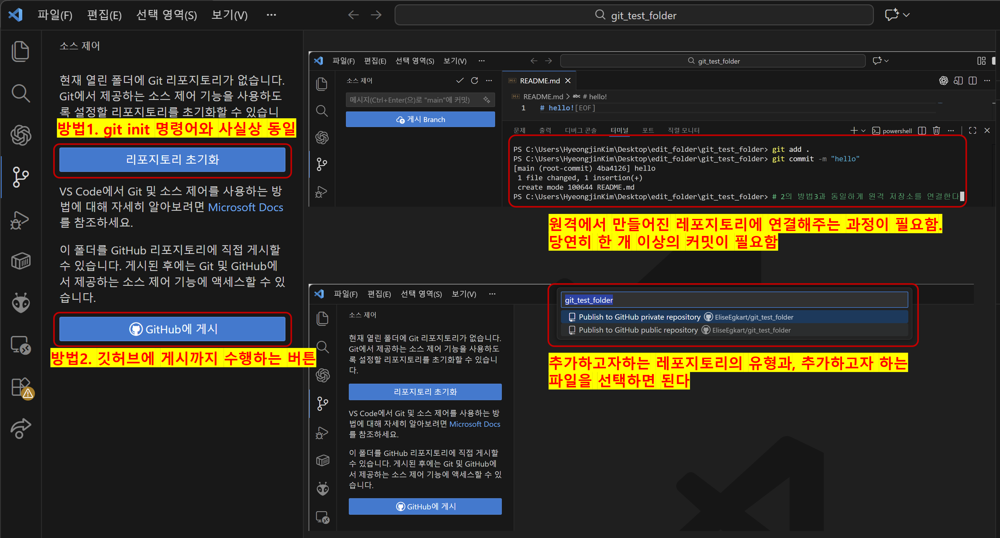

# 원격 저장소와 협업

이미 앞선 장들에서  
원격 레포지토리에서 **clone**, **push**, **pull** 같은 개념을  
슬쩍슬쩍 보고 넘어갔을 것이다.

하지만 **협업을 제대로 하려면 원격 저장소는 선택이 아니라 필수**다.

프로젝트의 규모가 커질수록 폴더 수와 파일 수는 늘어나기 때문이다!

물론 파일이 3~4개라면 메신저로 주고받을 수도 있다.  
하지만 **모든 파일을 실수 없이 전달하고, 누가 무엇을 언제 바꿨는지 관리하는 건 거의 불가능**하다.

그래서 Git은  
👉 **원격 저장소를 기준점으로 한 협업 모델**을 제공한다.

---


이 그림은 [03-commit-history.md](03-commit-history.md)에서 보았던  
**스테이징과 커밋 개념을 원격 저장소까지 확장한 구조**이다.

핵심은 단순하다.

- 로컬에서 `commit`으로 스냅샷(히스토리)을 만들고
- 그 히스토리를 `push`로 원격에 올리고
- 다른 사람의 히스토리를 `pull`로 다시 가져온다

---

## 협업에 대한 프로세스 정리

Git 협업의 기본 흐름은 다음과 같다.

1. 각자 **로컬 저장소**에서 작업
2. 의미 있는 변경 단위로 `commit`
3. 원격 저장소에 `push`
4. 다른 사람은 `fetch` 또는 `pull`로 변경 사항 확인
5. 필요하면 병합(merge) 또는 PR 수행

---

## 그럼 fetch는 무엇인가?

`fetch`는 `pull`과 비슷해 보이지만, **아주 중요한 차이**가 있다.

### git fetch
```sh
git fetch origin
```
- 원격 저장소의 변경 사항을 로컬로 가져오기만 함
- 작업 중인 브랜치에는 자동으로 반영되지 않음
- “일단 어떤 변화가 있는지 확인”하는 용도  
👉 즉, fetch = 가져오기만 하고, 합치지는 않는다.

### git pull
```sh
git pull origin main
```
- 내부적으로는 fetch + merge를 한 번에 수행
- 원격 변경 사항을 가져와 즉시 현재 브랜치에 반영  
👉 즉, pull = 가져와서 바로 합친다

## 우선 로컬 레포지토리를 원격으로 연결하는 방법부터 시작한다

Git에서 협업을 시작하려면  
**로컬 저장소(Local Repository)와 원격 저장소(Remote Repository)를 먼저 연결**해야 한다.  

이 연결이 되어야만 `push`, `pull`, `fetch`와 같은 협업 명령이 의미를 가지며,  
원격 저장소는 여러 사람이 작업을 공유하는 **중앙 기준점** 역할을 하게 된다.

원격 저장소를 연결하는 방법은 여러 가지가 있지만,  
교육 및 실습 환경에서 이해하기 쉬운 방식은 다음 **세 가지**로 정리할 수 있다.

---

### 1️⃣ GitHub 사이트에서 레포지토리를 만든 뒤, `clone`하여 사용하는 방법


이 방법은 **원격 저장소가 먼저 존재하는 경우**에 사용하는 가장 일반적인 방식이다.

- GitHub 웹사이트에서 레포지토리를 생성한 뒤
- `git clone` 명령어로 해당 레포지토리를 로컬로 복사한다

이 과정에서:
- 원격 저장소는 `origin`이라는 이름으로 **자동 연결**되고
- 로컬 저장소는 즉시 협업 가능한 상태가 된다

👉 이전에 다른 사람의 레포지토리를 가져오던 방식과 동일하며,  
팀 프로젝트에 처음 참여할 때 가장 많이 사용된다.

---

### 2️⃣ GitHub 사이트에서 레포지토리를 만든 뒤, `remote`로 직접 연결하는 방법


이 방법은 **로컬 프로젝트가 먼저 존재하는 경우**에 사용된다.

- GitHub에서 레포지토리를 생성하되  
  README, LICENSE, `.gitignore` 파일을 추가하지 않으면  
  GitHub에서 초기 설정 안내 화면이 나타난다
- 로컬에서는 다음 순서를 따른다.  
  1. `git init`으로 저장소 초기화  
  2. README 등 파일 추가  
  3. `git add` → `git commit`으로 **최소 한 번의 커밋 생성**
- 이후 `git remote add origin <URL>` 명령어로 원격 저장소를 연결한다

   >방법2.에 초점을 맞춰 이해하자.   
   방법1.은 사실상 `clone`하여 사용하는 방법이다  

👉 이 방법의 핵심은  
**원격 저장소에 push하기 전에 반드시 커밋이 하나 이상 존재해야 한다**는 점이다.  

이미 작성된 로컬 프로젝트를 GitHub에 올릴 때 적합한 방식이다.

---

### 3️⃣ VS Code 내부 소스 제어 기능을 활용하는 방법


VS Code는 Git과 GitHub를 통합하여  
원격 저장소 연결 과정을 **GUI 기반으로 제공**한다.

이 방식에는 두 가지 흐름이 포함된다.

- **방법 1**  
  - 내부적으로 `git init`과 동일한 작업 수행  
  - 이후 원격에서 만들어진 레포지토리와 연결하는 과정 필요  
  - 최소 한 개 이상의 커밋이 필요함
- **방법 2**  
  - GitHub에 레포지토리 생성부터 게시(push)까지 한 번에 수행  
  - 추가하고자 하는 레포지토리 유형과 포함할 파일을 선택하면 자동 처리

👉 빠르고 편리한 방법이지만,  
**내부적으로 어떤 Git 명령이 실행되는지는 반드시 이해하고 있어야**  
문제가 발생했을 때 원인을 파악할 수 있다.

---

## 주요 명령어
여기서 `origin`은 **원격 저장소의 기본 별칭(name)** 이다.  
`git clone`을 하면 원격 저장소가 자동으로 `origin`으로 등록되며,  
다른 이름(예: `upstream`)을 써도 되지만 기본값은 `origin`이다.

### 원격 저장소 연결하기.
```sh
git remote -v
# 원격 저장소 이름과 URL 확인, "확인 목적"

git remote add origin https://github.com/user/repo.git
# origin 이름으로 원격 저장소 연결

git remote remove origin
# origin 원격 저장소 연결 해제

```
### 파일 가져오기 방법1.
```sh
git fetch origin
git fetch #<--주로 이것만 사용함
# 원격 변경 사항만 가져오고 현재 브랜치에는 반영하지 않음
```
### 파일 가져오기 방법2.
```sh
git pull origin main
git pull #<--주로 이것만 사용함
# 원격 변경 사항을 가져와 현재 브랜치에 바로 반영
```
### 파일 올리기.
```sh
git push -u origin feature/login
git push
# 원격 저장소에 브랜치를 업로드(첫 push는 -u로 upstream 설정)
``` 
