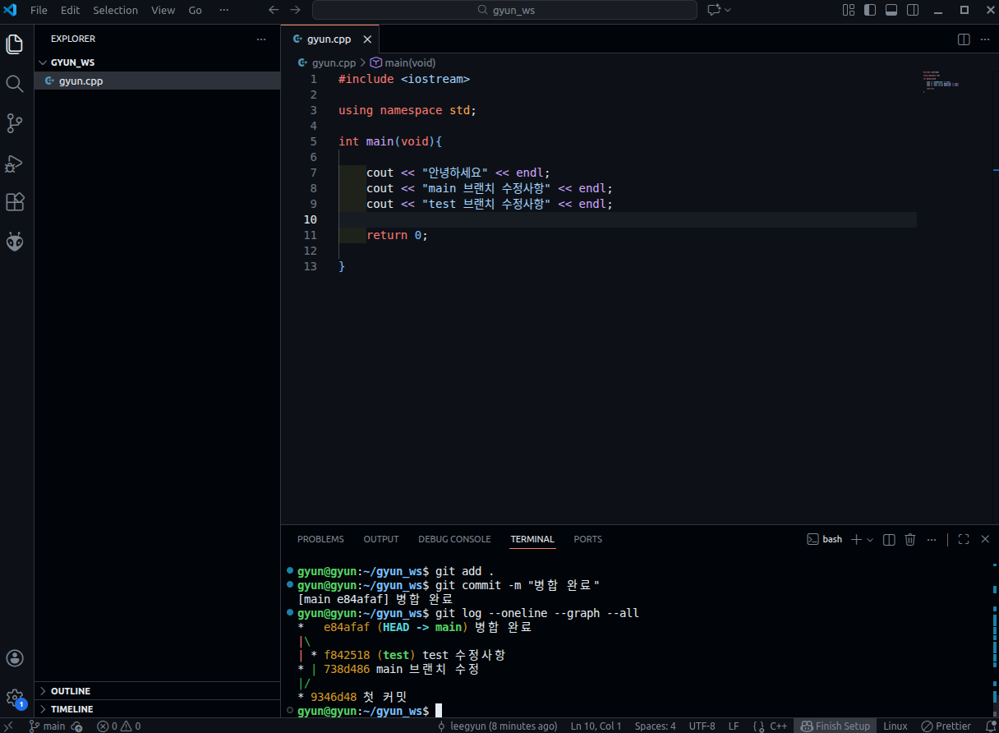

# Practice 답안 - 이기현(전기공학과)

---

## 문제 1. 브랜치 분기/병합 및 로그 그래프 캡처

---

## 문제 2. Fork 후 자기소개 문서 제출 및 PR 병합

자기소개

- 이름: 이기현
- 학과: 전기공학과
- 관심 분야: ROS2, 자율주행, 판단제어
- 하고 싶은 것: Path Planning 을 사용한 제어로직

PR 정보
- 링크 : https://github.com/EliseEgkart/github_tutorial/pull/85

## 문제 3. Issue 생성 + PR 승인 후 병합

Issue 정보
- 링크: https://github.com/EliseEgkart/github_tutorial/issues/86

PR 정보
- 링크: https://github.com/EliseEgkart/github_tutorial/pull/87