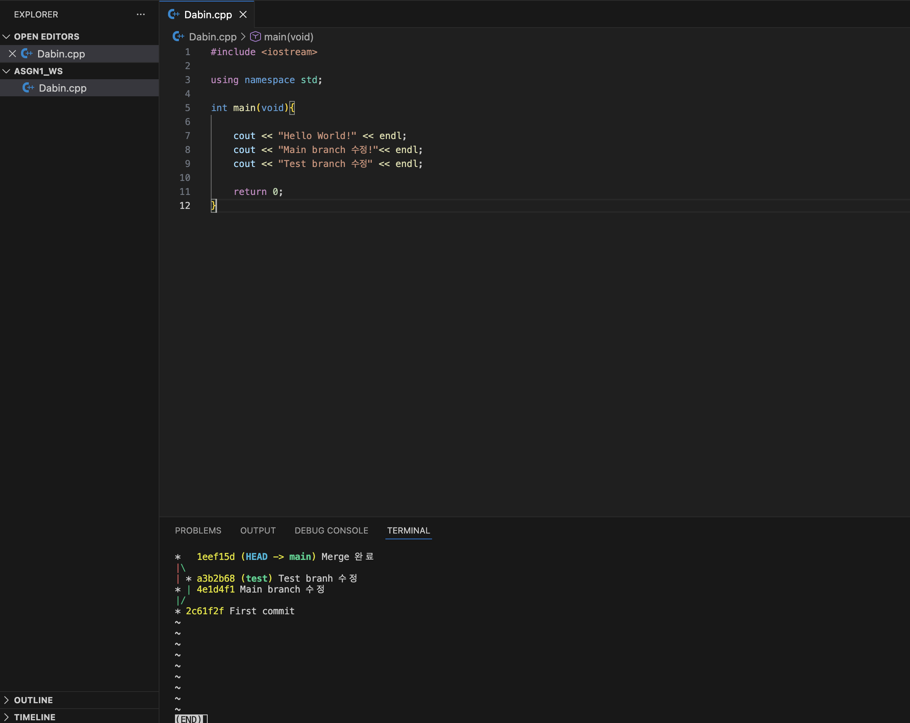

# Practice 답안 - 김형진(임베디드시스템공학과)

---

## 문제 1. 브랜치 분기/병합 및 로그 그래프 캡처
캡처 첨부
- 

---

## 문제 2. Fork 후 자기소개 문서 제출 및 PR 병합

자기소개(필수 사항)
- 이름: 이다빈
- 학과: 임베디드시스템공학과
- 관심 분야: ROS2, 임베디드
- 하고 싶은 것: 센서 융합 기반 주행/제어 프로젝트 경험 쌓기

PR 정보(예시)